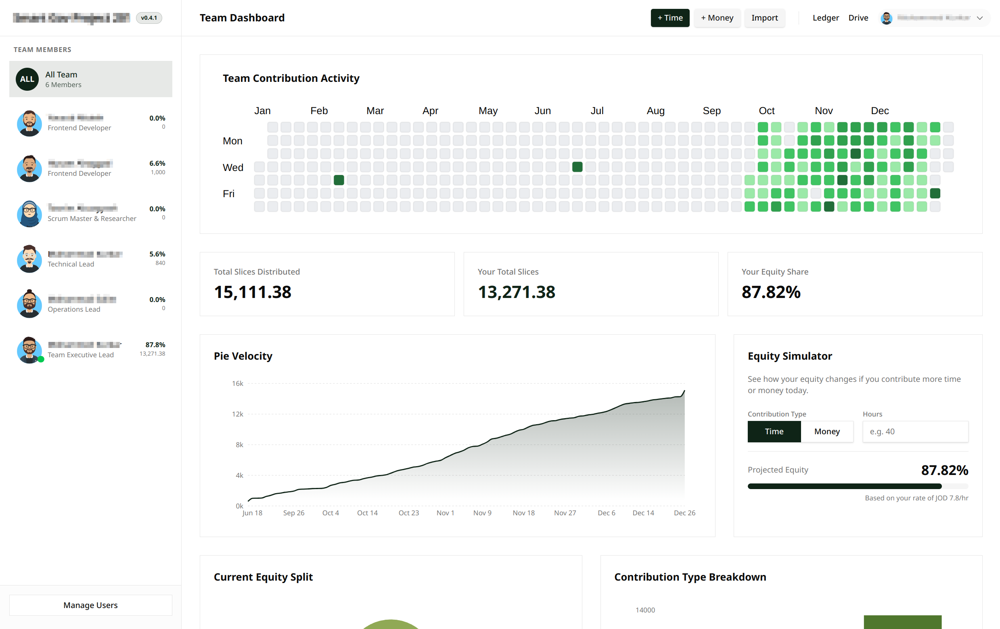
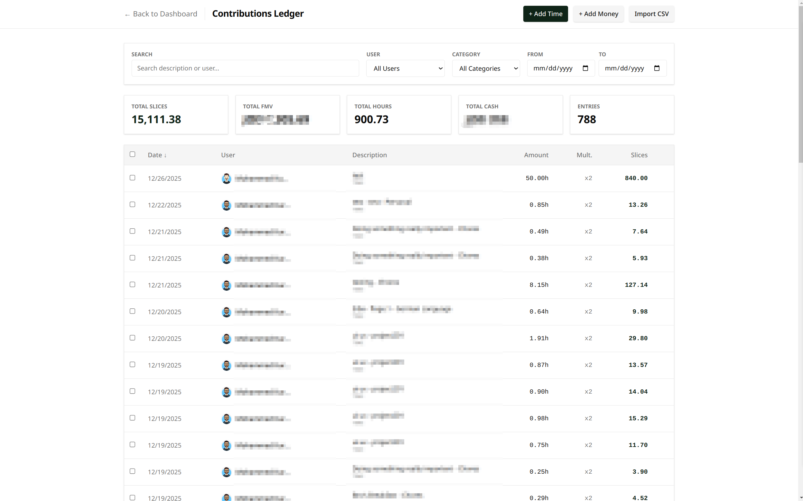
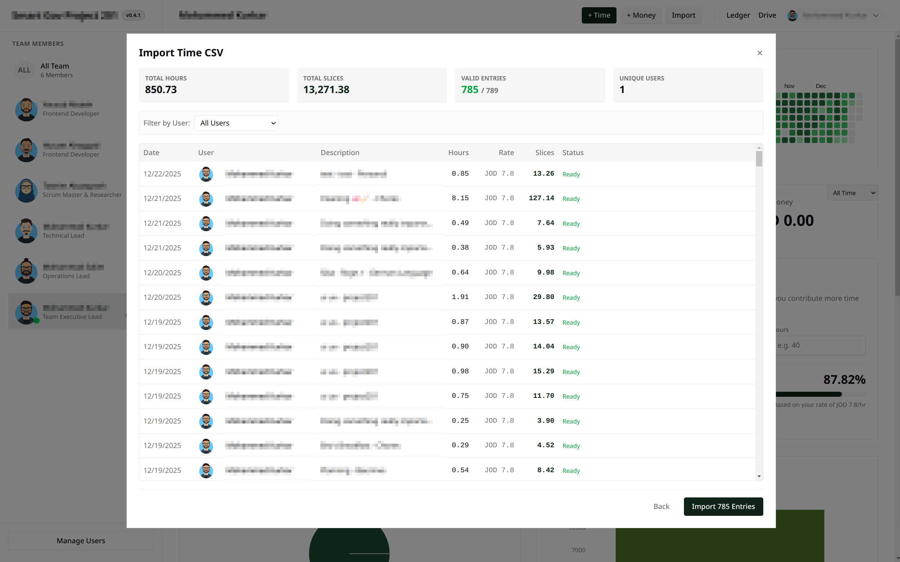

# Slicing Pie

### Dashboard
The main view gives you an instant snapshot of the current split and recent activity.


### The Ledger
Track every single contribution—time, money, ideas, or supplies.


### Importing Data
Got a CSV of time entries from (Toggl, SolidTime or Clickify)? No problem. Bulk import contributions easily.


## What is this?

Hello, I built this because splitting equity in a startup is usually a nightmare, and the **"Slicing Pie"** model is honestly the only fair way to do it. I wanted a tool that was simple, clean, and self-hosted so I could track everything without paying for expensive SaaS subscriptions or dealing with complex spreadsheets.

This project is based on the principles from the book **"Slicing Pie Handbook: Perfectly Fair Equity Splits for Bootstrapped Startups" by Mike Moyer**. If you haven't read it, you absolutely should. It outlines a dynamic equity split model that adapts as your startup evolves, ensuring everyone gets exactly what they deserve based on what they contribute.

This is a modern, real-time equity calculator that does the math for you.

## Who is this for?

*   **Founders** who care about fairness and transparency.
*   **Early-stage teams** who are bootstrapping and contributing time/money differently.
*   **Developers** who want a solid, self-hosted solution to manage their cap table dynamically.

## What does it do?

*   **Real-time Equity Tracking**: See exactly who owns what percentage of the company based on actual contributions.
*   **Smart Multipliers**: Automatically applies the Slicing Pie logic (e.g., 2x multiplier for unpaid time, 4x for cash).
*   **Visual Analytics**: Includes velocity charts, contribution breakdowns, and a "What If" calculator to model future scenarios.
*   **Team Hub**: Manage your co-founders, track activity feeds, and yes, it has a custom avatar generator because why not?
*   **Tech Stack**: Built on the bleeding edge with **Next.js 16**, **React 19**, **Tailwind CSS v4**, and **PocketBase**. It's fast, typed, and easy to extend.


## Quick Start

1.  **Get the backend running:**
    ```bash
    ./pocketbase/pocketbase serve
    ```
    *(Keep this terminal open)*

2.  **Install dependencies:**
    ```bash
    pnpm install
    ```

3.  **Run the frontend:**
    ```bash
    pnpm dev
    ```

4.  Open `http://localhost:3000` and start slicing!

## Tech Details

*   **Frontend**: Next.js 16 (App Router), React 19, TypeScript
*   **Styling**: Tailwind CSS v4
*   **Backend**: PocketBase (local instance included)
*   **Charts**: Recharts

Enjoy! If you're building something cool, this should help you keep the equity split drama-free.
